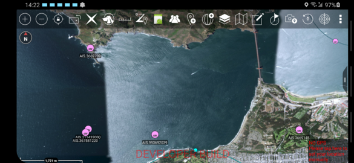

adsbcot - ADSB Cursor-on-Target Gateway.
****************************************

The adsbcot ADS-B Cursor on Target Gateway transforms ADS-B aircraft location
data to Cursor on Target (CoT) Position Location Information (PLI) for display
on Situational Awareness (SA) applications such as the Android Team Awareness
Kit (ATAK), WinTAK, RaptorX, et al.

ADS-B data can be read from various sources, including:

1. dump1090 Aircraft JSON HTTP feed, see: https://github.com/flightaware/dump1090/blob/master/README-json.md
2. ADSBExchange API call: https://www.adsbexchange.com/data/

CoT PLIs can be transmitted to SA clients using:

A. TCP Unicast to a specified port:address pair.
B. UDP Broadcast to a specified broadcast or multicast port:address pair.

For more information on the TAK suite of tools, see: https://www.civtak.org/

Installation
============

The command-line program `adsbcot` can be install from the Python Package Index
(Option A [preferred]), or directly from this source tree (Option B):

Option A) Install from the Python Package Index::

    $ pip install adsbcot

Option B) Install from this source tree::

    $ git clone https://github.com/ampledata/adsbcot.git
    $ cd adsbcot/
    $ python setup.py install

Usage
=====

The `adsbcot` command-line program has several runtime arguments::

    $ adsbcot -h
    usage: adsbcot [-h] -C COT_HOST [-P COT_PORT] [-B] [-I INTERVAL] [-S STALE]
                   [-D DUMP1090_URL] [-U ADSBX_URL] [-X ADSBX_API_KEY]

    optional arguments:
      -h, --help            show this help message and exit
      -C COT_HOST, --cot_host COT_HOST
                            CoT Destination Host (or Host:Port)
      -P COT_PORT, --cot_port COT_PORT
                            CoT Destination Port
      -B, --broadcast       UDP Broadcast CoT?
      -I INTERVAL, --interval INTERVAL
                            URL Polling Interval
      -S STALE, --stale STALE
                            CoT Stale period, in hours
      -D DUMP1090_URL, --dump1090_url DUMP1090_URL
                            Dump1090 URL
      -U ADSBX_URL, --adsbx_url ADSBX_URL
                            ADS-B Exchange API URL
      -X ADSBX_API_KEY, --adsbx_api_key ADSBX_API_KEY
                            ADS-B Exchange API Key

At a minimum, you'll need to specify:

1. -C COT_HOST, where COT_HOST is the IP or Hostname of the CoT Event destination.
2. One (1) of the following sets of arguments:
    A. -D DUMP1090_URL, where DUMP1090_URL is the URL to a system running the dump1090 ADS-B decoder.
    B. -U ADSBX_URL & -X ADSBX_API_KEY, where ADSBX_URL is the URL to a ADS-B Exchange feed you'd like to use, and ADSBX_API_KEY is your ADS-B Exchange API Key.

Build Status
============

Master:

.. image:: https://travis-ci.com/ampledata/adsbcot.svg?branch=master
    :target: https://travis-ci.com/ampledata/adsbcot

Develop:

.. image:: https://travis-ci.com/ampledata/adsbcot.svg?branch=develop
    :target: https://travis-ci.com/ampledata/adsbcot

Source
======
Github: https://github.com/ampledata/adsbcot

Author
======
Greg Albrecht W2GMD oss@undef.net

https://ampledata.org/

Copyright
=========
Copyright 2020 Orion Labs, Inc.

License
=======
Apache License, Version 2.0. See LICENSE for details.
